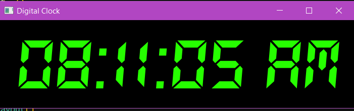

# 🕐 PyQt5 Digital Clock

> A sleek, minimal digital clock built with Python & PyQt5 — because your system clock is mid.


---

## ✨ What's This?

A real-time digital clock GUI app using **PyQt5** — renders the current time in a custom 7-segment display font (`DS-DIGIT.TTF`) with a clean black-on-neon-green aesthetic. Updates every second via `QTimer`. No cap, it looks fire.

Built as part of learning **OOP + PyQt5** in Python — specifically demonstrates inheritance with `QWidget`.

---

## 🖥️ Preview



---

## 🚀 Getting Started

### Prerequisites

- Python **3.8+**
- pip

### 1. Clone the repo

```bash
git clone https://github.com/itssujalcoder24/Digital_Clock_Demo.git
cd pyqt5-digital-clock
```

### 2. (Recommended) Create a virtual environment

```bash
python -m venv venv

# Windows
venv\Scripts\activate

# macOS/Linux
source venv/bin/activate
```

### 3. Install dependencies

```bash
pip install -r requirements.txt
```

### 4. Set up the font

> ⚠️ **This step is important or the clock won't look right.**

- The app uses the **DS-DIGIT.TTF** font for that classic 7-segment display look.
- Place the font file inside the project root (same folder as `digital_clock.py`).
- Download it free from [dafont.com](https://www.dafont.com/ds-digital.font) or any trusted font source.
- Then update line ~26 in `digital_clock.py`:

```python

# (Use relative path — much better ✅) and Recommended
font_id = QFontDatabase.addApplicationFont('DS-DIGIT.TTF')
```

### 5. Run the app

```bash
python digital_clock.py
```

---

## 📁 Project Structure

```
pyqt5-digital-clock/
│
├── digital_clock.py      # Main application file
├── DS-DIGIT.TTF          # Custom font (add this manually — see above)
├── requirements.txt      # All dependencies, one pip away
├── .gitignore            # Keeping the repo clean
├── LICENSE               # MIT — use it however you want
└── README.md             # You are here 📍
```

---

## 🧠 Concepts Used

| Concept | Where |
|---|---|
| OOP / Inheritance | `DigitalClock` extends `QWidget` |
| PyQt5 Widgets | `QLabel`, `QVBoxLayout`, `QWidget` |
| Timer / Events | `QTimer` triggers `update_time()` every 1s |
| Custom Fonts | `QFontDatabase.addApplicationFont()` |
| Stylesheets | Inline CSS-like styling on widgets |

---

## 🛠️ Built With

- [Python 3](https://www.python.org/)
- [PyQt5](https://pypi.org/project/PyQt5/) — Qt bindings for Python
- [DS-Digital Font](https://www.dafont.com/ds-digital.font) — for the retro LED look

---

## 🤝 Contributing

Pull requests are welcome! If you wanna add features (dark mode toggle, alarm, stopwatch, etc.) — go off, fr.

1. Fork the repo
2. Create your branch: `git checkout -b feature/cool-feature`
3. Commit: `git commit -m 'add some cool feature'`
4. Push: `git push origin feature/cool-feature`
5. Open a PR 🙌

---

## 📄 License

Distributed under the **MIT License**. See [`LICENSE`](LICENSE) for more info.

---

## 👤 Author

**Sujal**
- GitHub: [@itssujalcoder24](https://github.com/itssujalcoder24)

---

> *"Why read the system time when you can render it yourself?"* 🕰️
